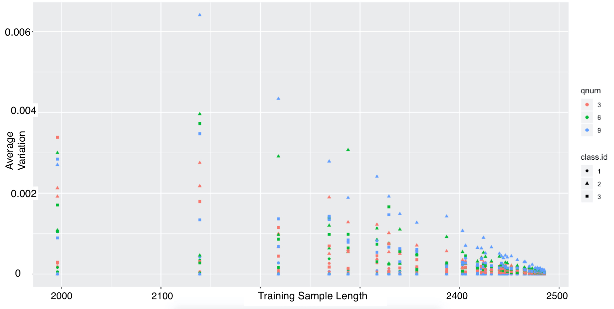
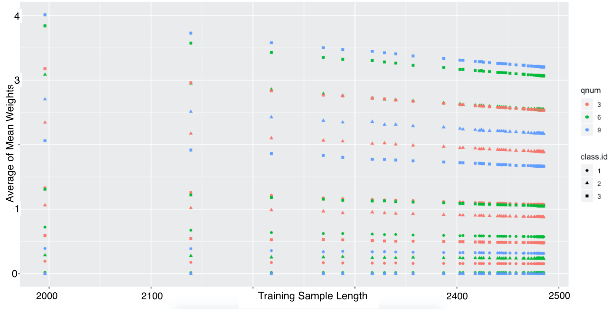
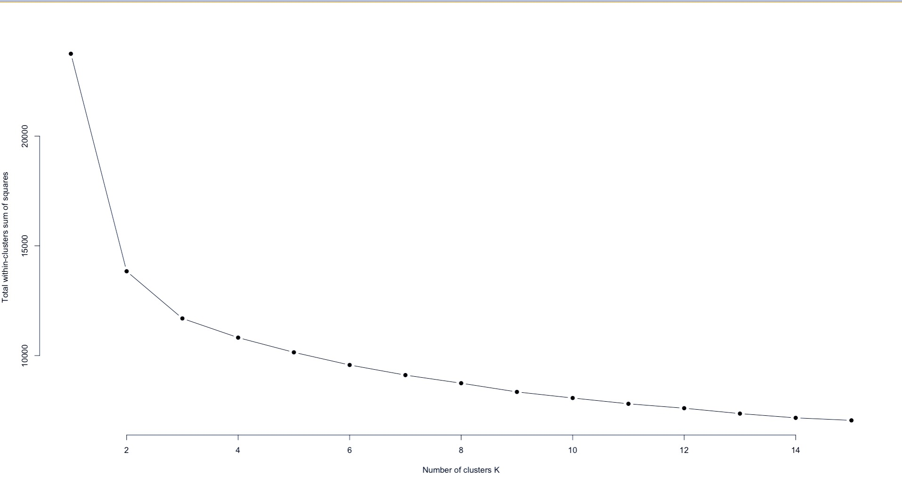
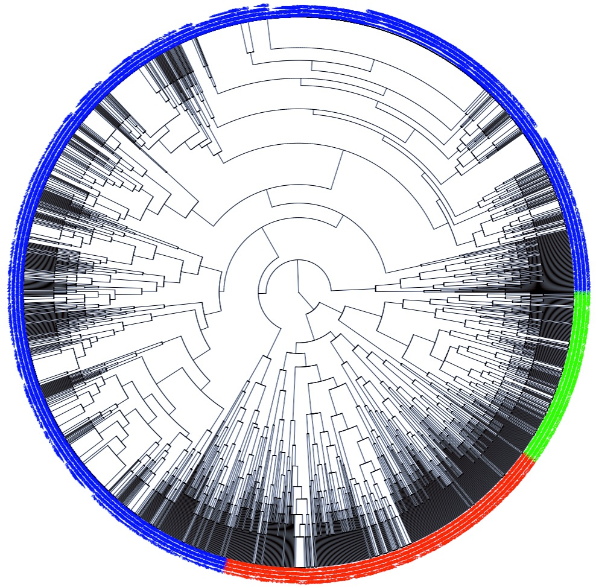
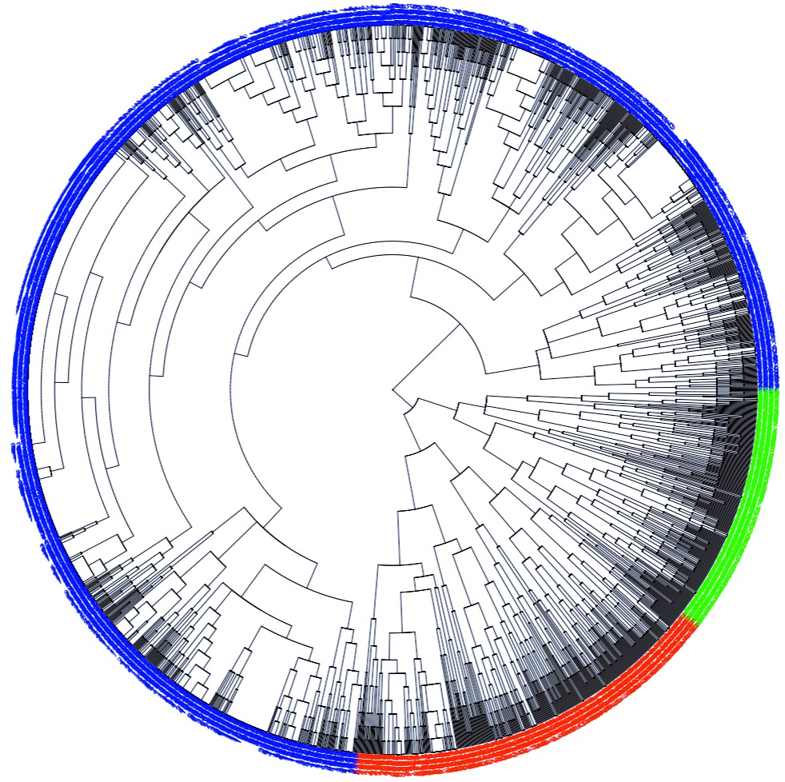
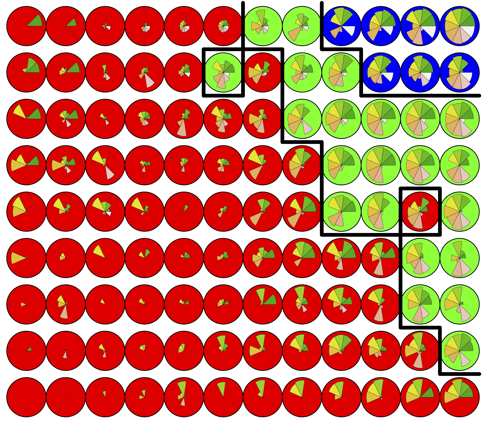
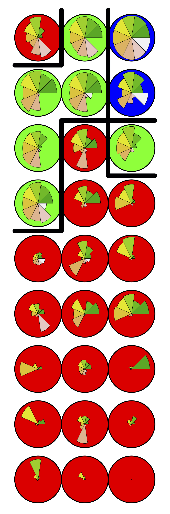
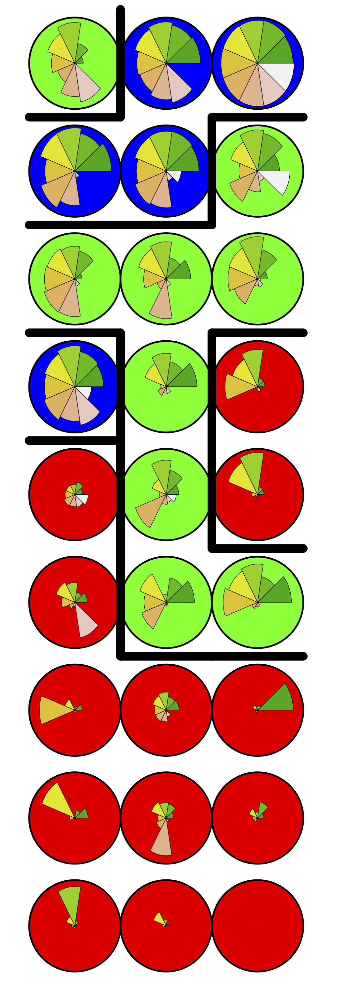

<!------------------------------------------------------------------------------>
<!--  ####  KNITR Setup & Script Information   #### -->
<!------------------------------------------------------------------------------>

<!--  ####  KNITR Specs   #### -->
```{r setup, cache=TRUE, echo=FALSE, eval=TRUE}
knitr::opts_chunk$set(echo=FALSE, 
                      cache = TRUE, 
                      fig.align = "center",
                      fig.width = 5)
```


<!-- ####	 Set Working Directory	 ####   -->
```{r, echo=FALSE}
WD="/Users/lee/Documents/GitHub/ProbabilisticScoring/WriteUps/Outline"
setwd(WD)
```
<!------------------------------------------------------------------------------>

\newpage


\setcounter{secnumdepth}{4}
\setcounter{tocdepth}{4}
\tableofcontents


\newpage

<!------------------------------------------------------------------------------>


# Introduction

## Background & Context necessary for project
  
- The Patient Health Questionnaire-Nine (PHQ9)
  - Self-administered module
  - Can be administer by medical staff
  - Nine questions, answers correspond to the frequency with which respondents feel certain feelings
  - Used for screening, monitoring, and grading severity of depressive symptoms related to nine criteria outlined by the Diagnostic and Statistical Manual of Mental Health Disorders (DSM-IV) [@kroenke2002phq]
  - Developed by Dr. Robert J. Spitzer, Dr. Janet B.W. Williams, Dr. Kurt Kroenke in 1999 with a grant from Pfizer [@kroenke2010instruction]
  - Response sets are classified into a discrete set of categories corresponding to depression symptom magnitude
  - Three categories corresponding to: "Not clinically Depressed", "Sub-threshold Depression", and "Major Depression" will be used for this analysis
  
  
  
## Data

### Data Origin: 
  - Federally Qualified Health Research Center in Montana [@MalikMoreEf]
  - Collected over six month time frame
  - Tablet-administered PHQ9s and Quick Diagnostic Panels (QDPs)

### Data Properties:
  - Technically a Randomized Control Design based upon assignment of QDPs, but observational based upon PHQ9 data
  - 2495 observations
  - 286 variables: PHQ9 data, QDP variables, Control variables, Demographic variables, Record-keeping (time, date, etc) variables
  - De-identified, and left without validation outcome measurement
  - No theoretically "correct" classification
  - Each observation contains integer-value responses (0-3) for the nine PHQ9 questions
  - No missing data
  - Original test was administered sequentially, with all questions being asked
  - Some respondents had taken the QDP first


## Classification Methods 

- Let $i=1, 2, \ldots, N=2495$ represent a particular observation from the PHQ9 data  
- and let $q=1, \ 2, \ldots, 9$ represent a specific question within each response sequence  
- each response, to each qustion in an oberservation sequence will be denoted $A_{iq}=a_{iq}$ where the random variable $A_{iq}$ is associated with the outcome $a_{iq}$  
- In referring to an arbitrary (fixed) observation $I=i^{*}$ we will use the shortened notation:
  - $A_{i^{*}q}=A_{q}=k$ where $k\in \{ 0,\ 1, \ 2, \ 3 \}$

<!-- - We will denote each response sequence as: $\mathbf{A}_{(i)}=\left \{ A_{iq} \right \}_{q=1}^{Q=9} = \left(A_{i1}, \ A_{i2}, \ A_{i3}, \ldots , \ A_{i9} \right)$ for a fixed observation $I=i$    -->
<!-- - and we will have need to referrence the question response vectors $\mathbf{A}_{(q)}=\left \{ A_{iq} \right \}_{i=1}^{N=2495} = \left(A_{1q}, \ A_{2q}, \ A_{3q}, \ldots, \ A_{2495q} \right)$ of a fixed question $Q=q$ -->

### Traditional Classification
  - The traditional classification of observation $i$ will be denoted:
    $$C_{i}^{TR} \in \mathbf{C}_{i}^{TR}=\left(1_{i}^{TR}, \ 2_{i}^{TR}, \ 3_{i}^{TR} \right)$$
  - The sum of an answer set provided in observation $i$ is represented by:
    - $S_{i} = \sum_{q=1}^{9} a_{iq}$
  - the value of $S_{i}$ is used to assign a traditional classification to observation $i$
  - Depression classification outcomes are distinguished by "threshold values"
    - let $\alpha_{1}, \ \alpha_{2} \ \in  \left \{ 0, \ldots, 27 \right \}$ with $\alpha_{1} \leq \alpha_{2}$ be threshold values
    - We can define the Traditional Classification outcome sets as $C^{TR}$ for $C=1,2,3$ using Level sets according to:
      - $1^{TR}=\left \{i \ \Big | \ S_{i} < \alpha_{1}  \right \}$
      - $2^{TR}=\left \{i \ \Big | \ \alpha_{1} \leq S_{i} < \alpha_{2}  \right \}$
      - $3^{TR}=\left \{i \ \Big | \ \alpha_{2} \leq S_{i}  \right \}$
  - for this analysis, threshold values are: $\alpha_{1}=7$ and $\alpha_{2}=10$
  - 88% accurate [@kroenke16spitzer]
  - 12% FP/FN causes issues with Clinical Fatigue, patient concern, and healthcare system burdens
  - Outcomes provide limited information
  - Need to take the entire PHQ9 in order to achieve results
  
###  Probabilistic Classification
- Possible benefits:
  - Reduced test-taking requirements (early convergence)
  - Increased relatability with other Mental Health disorders, and better result integration in general
  - Not dependent on numerical assignments: integer differences of outcomes less influential.
  - Training-sample accuracy increase possibility
- The algorithm:
  - The probabilistic classification of observation $i$ will be denoted:
  $$C_{i}^{PR} \in \mathbf{C}_{i}^{PR}=(1_{i}^{PR}, \ 2_{i}^{PR}, \ 3_{i}^{PR})$$
  - Given a set of training observations $\mathbf{S}_{Train}$ of length $|N_{train}|$, we may characterize the probability of certain events within that training set:
    - The probability that a response value of $k \in \left \{ 0, 1, 2, 3 \right \}$ is provided to question $Q=q$ where $q\in\left \{1,\ldots,9\right \}$ is given by:
      $$P\left(A_{q}=k \right) = \frac{1}{|N_{train}|}\sum_{i=1}^{|N_{train}|} \mathbb{I}\left(A_{iq}=k \right)$$
      where
      $$\mathbb{I}\left(A_{iq} = k \right)=
      \begin{cases}
        0 &\mbox{if} \quad  a_{iq} \neq k \\
        1 &\mbox{if} \quad  a_{iq}=k \\  
      \end{cases}
      $$
    - The probability that an observation is assigned (via traditional classification) into into traditional classification class $C^{TR}=j$ where $j \in \left \{  1, \ 2,  \ 3 \right \}$ is given by: 
    $$P\left( C^{TR} = j \right) = \frac{1}{|N_{Train}|} \sum_{i=1}^{|N_{train}|} \mathbb{I}\left(C_{i}^{TR}=j \right)$$
    where
      $$\mathbb{I}\left(C_{i}^{TR}=j \right)
      \begin{cases}
        0 &\mbox{if} \quad  j \neq c \\
        1 &\mbox{if} \quad  j = c \\  
      \end{cases}
      $$
    - The probability that an observation's response value is $k \in \left \{ 0, 1, 2, 3 \right \}$ in question $Q=q$ and that same observation also has been assigned into traditional classification class $C^{TR}=j$ is given by:
    $$P\left(A_{q} = k \bigcap C^{TR}=j  \right) =  \frac{1}{|j^{TR*}|} \sum_{i \in j^{TR*}} \mathbb{I} \left(A_{iq}=k \right) $$
      where we are defining the level set:
      $$j^{TR*}= \left \{  i \in \mathbf{S}_{Train} \Big | i \in j^{TR} \right \}$$
      for $j=1,2,3$
      
      and the value $|j^{TR*}|$ represents the number of elements in $j^{TR*}$
      
- These probabilities allow us to define a weight parameter corresponding to each 108 distinct combination of
   - question number: $Q=q \in \left \{ 1, \ 2, \ldots, 9 \right \}$
   - response value: $A_{q} = k \in \left \{  0, 1, 2, 3 \right \}$
   - traditional classification: $C^{TR} = j$
   \begin{align*}
      \mathbf{W}_{A_{q}}^{j^{TR}} &= \frac{P\left(A_{q}=k \ \Big | \ C^{TR}= j  \right) }{P\left(A_{q}=k \right) } \tag{EQ-XX} \\[0.5em]
      &= \frac{ P\left(A_{q}=k \ \bigcap \ C^{TR}= j \right) }{P\left(A_{q}=k \right) P\left( C^{TR}= j \right)} \\[0.5em]
      &= \frac{\frac{1}{|j^{TR*}|} \sum_{i \in j^{TR*}} \mathbb{I} \left(A_{iq}=k \right)}{\left( \frac{1}{|N_{train}|}\sum_{i=1}^{|N_{train}|} \mathbb{I}\left(A_{iq}=k \right) \right) \left( \frac{1}{|N_{Train}|} \sum_{i=1}^{|N_{train}|} \mathbb{I}\left(C_{i}^{TR}=j \right) \right)  } \\[0.5em]
      &= \left(\frac{|N_{Train}|^{2}}{|j^{TR*}|} \right) \left(\frac{ \sum_{i \in j^{TR*}} \mathbb{I} \left(A_{iq}=k \right)}{\left( \sum_{i=1}^{|N_{train}|} \mathbb{I}\left(A_{iq}=k \right) \right) \left( \sum_{i=1}^{|N_{train}|} \mathbb{I}\left(C_{i}^{TR}=j \right) \right)}   \right)  
   \end{align*}
- Using the weights, we may now calculate the probabilistic classification score:
  - A pre-specified confidence threshold value $\gamma \in (0,1)$ determines the stopping point of the algoritm which proceeds recursively according to the framework:  
    - Let $\mathbf{C}_{(q)}^{PR}=\left(1_{(q)}^{PR}, \ 2_{(q)}^{PR}, \ 3_{(q)}^{PR}   \right)$ represent the $q^{th}$ iteration of the probabilistic re-weighting algorithm, for $q=1, \ldots, 9$  
  \begin{align*}
\left(1_{(0)}^{PR}, \ 2_{(0)}^{PR}, \ 3_{(0)}^{PR} \right) &= \left( \frac{1}{3}, \  \frac{1}{3}, \ \frac{1}{3}\right) \\[0.5em]
    \left(1_{(q+1)}^{PR}, \ 2_{(q+1)}^{PR}, \ 3_{(q+1)}^{PR} \right) &= \frac{\left(1_{(q)}^{PR}W_{A_{q}}^{1^{TR}}, \ 2_{(q)}^{PR}W_{A_{q}}^{2^{TR}}, \ 2_{(q)}^{PR}W_{A_{q}}^{2^{TR}} \right) }{\sum_{j=1}^{3} j_{(q)}^{PR}W_{A_{q}}^{j^{TR}}} \tag{EQ-XX} \label{1.3.2 - 2}
  \end{align*}  
  for $q=1, 2, \ldots, 9$  
    
  - If we define:
    $$j_{q}^{*}= \underset{j}{max} \  j_{q}^{PR}$$
    and
    $$q^{*}=\underset{q}{min} \ \left \{q : j^{*}_{q} > \gamma    \right \} $$
    then (provided that $q^{*}$ exists), the probabilistic scoring classification is:
    $$j_{q^{*}}^{*PR}=\underset{j}{max} \ j_{q^{*}}^{PR}$$
  

## Consultation goals and deliverables

### Client's Specified Goals: 

> "...mathematically prove that probabilistic scoring is more accurate than conventional scoring"

> "...mathematically prove that probabilistic scoring derived from a conventional scored validation dataset is essentially as accurate as using the original validation dataset and therefore still more accurate than conventional scoring"

### Analysis Goals:
  - Compare Probabilistic Scoring accuracy to Conventional Scoring accuracy measured against simulated responses generated using information in PHQ9 data.
  - Determine how accuracy comparisons vary as a function of training sample size.
  
### Deliverables:
  - Presentable results.  Evidence of outcomes that can be shown to potential clients with the purpose of demonstrating the practical advantages of Probabilistic Scoring. 
  - Relationship Diagrams.  Visualizations that can be utilized to show informational gain when Probabilistic Scoring is implemented.  Particular interest in relating outcomes to specific question answers.
  

  

***

# Model and Methods

## Quantifying Accuracy
- Accuracy as a function of model value and validation outcome
  $$\text{Accuracy} = f(\mathbf{y}, \mathbf{\hat{y}}) = \frac{1}{N} \sum_{i=1}^{N}  I\left(y_{i}=\hat{y}_{i} \right)$$
  - where $\mathbf{y}=\left(y_{1}, \ldots, y_{N}\right)$ is the validation outcome
  - $\mathbf{\hat{y}}=\left(\hat{y}_{1},\ldots, \hat{y}_{N}   \right)$ is the model value
  - $I\left(y_{i}=\hat{y}_{i} \right)=\begin{cases} 0 &\mbox{if} \quad  y_{i} \neq \hat{y}_{i} \\ 1 &\mbox{if} \quad  y_{i} = \hat{y}_{i} \\ \end{cases}$
- Accuracy as a function of model value and \textit{simulated} validation outcome
  $$\tilde{\text{Accuracy}} = f(\mathbf{\tilde{y}}, \mathbf{\hat{y}}) = \frac{1}{N} \sum_{i=1}^{N}  I\left(\tilde{y}_{i}=\hat{y}_{i} \right)$$
  - where $\mathbf{\tilde{y}}=\left(\tilde{y}_{1}, \ldots, \tilde{y}_{N}   \right)$ is the simulated validation outcome
- Simulated accuracy calculation can be performed for Traditional and Probabilistic Classifications, and then compared:
\begin{align*}
\tilde{Accuracy_{TR}} &\sim \tilde{Accuracy_{PR}} \\[0.5em]
f\left(\mathbf{\tilde{y}}, \mathbf{\hat{y}}^{TR} \right)  &\sim f\left(\mathbf{\tilde{y}}, \mathbf{\hat{y}}^{PR} \right) \tag{EQ-XX} \label{2.1-1}
\end{align*} 
- This analysis will focus on estimating various values of $\tilde{accuracy}$ using multiple methods of generating values of $\tilde{\mathbf{y}}$


## Cross Validation Processing:

- Estimating $\tilde{Accuracy}$ using Cross Validation allows us to obtain an average-stabilized estimate of both Pscore and traditional classifications simultaneously, and to establish the relationship between training sample size and accuracy
- For a fixed value of $K \in \left \{ 1, 2, \ldots, N \right \}$ we partition the full data set into $K$ equal subsets, each of which has $N_{K}$ observations sampled randomly without replacement from the original data, where:
  $$N_{K}=\Big \lfloor \frac{N}{K} \Big \rfloor$$
- We now have $K$ distinct data sets that have been subset from the original data, which we will combine into test-train pairs 
- There are $K$ different ways in which $K-1$ data sets can be chosen from $K$ sets when order does not matter:
\begin{align*}
\binom{k}{k-1} &= \frac{k!}{(k-1)!(k-(k-1))!}\\[0.5em]
&= \frac{k!}{(k-1)!}\\[0.5em]
&= k
\end{align*}
- for each of these $K$ combinations we create a train-test combination by combining the $K-1$ selected sets to form the training set, and the remaining set to form the test set.
- We will denote these train/test pairs
  $$\left(TR, TE \right)^{K}_{j}=\left(TR_{j}^{K}, TE_{j}^{K} \right) $$ 
  where K will represent the partition number value for the original separations and $j=1, \ldots, K$
- From the definition of $N_{K}$, and the fact that each training set is a union of $\left(K-1 \right)$ sets of length $N_{K}$, we can establish a relationship between training set length, i.e. $|TR_{j}^{k}|$ the number of observations in the $j^{th}$ training set and the value of $K$ from which the original test-train partitions were formed:  
  $$|TR_{j}^{k}|=(K-1)N_{K}=(K-1)\Big \lfloor \frac{N}{K} \Big \rfloor$$
- Similarly, we may define the length of the test set:
  $$|TE_{j}^{k}|=N_{K}=\Big \lfloor \frac{N}{K} \Big \rfloor$$
- noting that: 
$$\Big \lfloor \frac{N}{K} \Big \rfloor \leq \frac{N}{K}$$
We have
\begin{align*}
|TR_{j}^{K}| + |TE_{j}^{K}| &= (k-1)\Big \lfloor \frac{N}{K} \Big \rfloor + \Big \lfloor \frac{N}{K} \Big \rfloor \\[0.5em]
&= K \Big \lfloor \frac{N}{K} \Big \rfloor \\[0.5em]
&\leq K \frac{N}{K} = N
\end{align*}
Implying that observations will be left out of the sampling process in the selection of subsets. This is due to the definition of the subsample sizes chosen using the floor function which is not injective on real valued domains.  
- We are interested in establishing a relationship between $|TR_{j}^{k}|$ and $\tilde{accuracy}$, idealistically represented by:
\[
\tilde{accuracy}\left( |TE_{j}^{k}|  \right) = \tilde{accuracy}\left( \Big \lfloor \frac{N}{K} \Big \rfloor  \right) \tag{EQ-XX} 
\]
  This formula establishes a connection between the value of $K$ and $\tilde{accuracy}$.  Demonstrating that by calculating the value of $\tilde{accuracy}$ at varying the value of $K$, we may establish the relationship between $\tilde{accuracy}$ and $|TR_{j}^{k}|$ (i.e. Training Sample Length).
- We can calculate the calculate the classification accuracy for each train-test pairing within a specific value of K.
  $$\tilde{accuracy}\left(TR, TE \right)_{j}^{k}= \frac{1}{|TE_{j}^{k}|} \sum_{i=1}^{|TE_{j}^{k}|} I\left(\tilde{y}_{i}=\hat{y}_{i} \right) $$
- and we will use the average of these values to represent the accuracy at a particular K-value
  \begin{align*}
    \tilde{accuracy}\left(TR, TE \right)^{k} &= \tilde{accuracy}_{m}\left(TR, TE \right)_{\bullet}^{k} \\
    &=\frac{1}{K}\sum_{j=1}^{K} \left \{ \tilde{accuracy}\left(TR, TE \right)_{j}^{k}\right \} \\
    &=  \frac{1}{K}\sum_{j=1}^{K} \left \{ \frac{1}{|TE_{j}^{k}|} \sum_{i=1}^{|TE_{j}^{k}|} I\left(\tilde{y}_{i}=\hat{y}_{i} \right) \right \}
  \end{align*}
- This process can be applied to Traditional and Probabilistic Scoring methods:
  \begin{align*}
    \tilde{accuracy}_{m}\left(TR, TE \right)^{k} &= \frac{1}{K}\sum_{j=1}^{K} \left \{ \tilde{accuracy}_{m}\left(TR, TE \right)_{j}^{k}\right \} \\
    &=  \frac{1}{K}\sum_{j=1}^{K} \left \{ \frac{1}{|TE_{j}^{k}|} \sum_{i=1}^{|TE_{j}^{k}|} I\left(\tilde{y}_{i}=\hat{y}_{i}^{m} \right) \right \}
  \end{align*}
  where $m\in\left \{ Pscore, \ Tscore    \right \}$, $\hat{y}^{Pscore}$ is a Probabilistic Scoring generated outcome, and $\hat{y}^{Tscore}$ is a Traditional Scoring generate outcome
- It will also be applied to a multitude of different simulated validation outcomes
    \begin{eqnarray*}
    \tilde{accuracy}_{m}^{h}\left(TR, TE \right)^{k} &= \frac{1}{K}\sum_{j=1}^{K} \left \{ \tilde{accuracy}_{m}^{h}\left(TR, TE \right)_{j}^{k}\right \} \\
    &=  \frac{1}{K}\sum_{j=1}^{K} \left \{ \frac{1}{|TE_{j}^{k}|} \sum_{i=1}^{|TE_{j}^{k}|} I\left(\tilde{y}_{i}^{h}=\hat{y}_{i}^{m} \right) \right \}
  \end{eqnarray*}
  where the values of $h$ will be outlined in \textbf{Section XX}.
- Since notation is obviously cumbersome, indices displayed will be limited only to those relevant.
- \textbf{Figure XX}
- 
- \textbf{Figure XX:} Training and Test set observation counts vs K
- We see that the possible training set observation counts using the CV method outlined above on the data provided range between 1247 and 2492 observations.
- The figure also shows that for K-values greater than 1248, test set sizes are confined to one.
- Training set sizes were selected for analysis by sampling 50 different values of K from k=5 to k=2490.
- Plots of comparing accuracies in the form of \eqref{2.1-1} are shown for each value of K selected as the value of training set length corresponding to K increases
- It was assumed that subsets taken from the data which were sampled randomly without replacement are at least partially representative of the population as a whole.


## Optimal Convergence Criterion 
- The Pscore algorithm requires the specification of a confidence level for termination.
- For the purposes of this analysis, a confidence level of 0.75 was chosen.
- This value optimized probabilistic scoring classification accuracy of the first simulated validation outcome (see below) when the Pscoring weights were trained on the full data set.

## Simulated Validation Outcomes

### Inferential Simulations
- Theoretical assumptions made:
  - Depression Classifications are a hierarchy, so outcomes for group 1 are lower than group 2,...etc
  - Within each class there is a spectrum of conditions, and transitions between classes are essentially continuous.
  - The 12 percent misclassification is due to the traditional scoring algorithm mis-classifying observations into a proximal class.  Group 1 into group 2, group 3 into group 2 or group 2 into either group 1 or 2.
- Practical implementations of quantity switched related to:
  - traditional sum statistic
    - Let $\mathbb{S}^{PR}_{T}=\left \{ i\ \Big | \ S_{i}=T \right \}$ for $i=1,\ldots, N$ and $T=0, 1,\ldots, 27$ where $S_{i} = \sum_{q=1}^{9} a_{q}$
    - Then the number of observations with the same traditional sum-score ($S_{i}$) is the value: $|\mathbb{S}^{PR}_{T}|$
  - Distance from a threshold value.  Meaning that observations which are closer to a threshold value are more likely to be mis-classified (switched)
    - If we suppose that $\alpha_{1} \leq \alpha_{2} \in \ \left \{ 0,1,\ldots, 27 \right \}$ are threshold values.  The distance to the nearest threshold value of an observation $i$ that is classified into traditional sum value $S_{i}$ is:
  $$D_{i} = \underset{k=1,2}{min}\left \{ \Big | \alpha_{k}-S_{i}   \Big | \right \}$$
- The final probability of a traditional classification being altered in its representation in the simulated outcome data set:
  - $P\left(j_{i}^{TR} \neq \tilde{j}_{i} \right) \propto \frac{|\mathbb{S}^{PR}_{T}|}{D_{i}}$
  - Proportionality constants were chosen so that the total difference between Traditional Scoring classification and simulated outcome was 12\%
  - Specific values of  $P\left(j_{i}^{TR} \neq \tilde{j}_{i} \right)$ that were used for this analysis are displayed in \textbf{Table XX}
  

\begin{center}
\begin{tabular}{|c|c|c|c|c|c|c|c|c|}
\hline
Trad Sum & Orig Class & SimClass & $D_{\alpha_{1}}$ & $D_{\alpha_{2}}$ & $|\mathbb{S}_{T}^{PR}|$ & NO Flip & Prop Const & \% Total Data \\
\hline
\hline
5 & 1 & 2 & 2 & 5 & 149 & 42 & 0.564 & 0.017 \\
\hline
6 & 1 & 2 & 1 & 4 & 137 & 63 & 0.460 & 0.025 \\
\hline
7 & 2 & 1 & 0 & 3 & 108 & 42 & 0.194 & 0.017 \\
\hline
8 & 2 & 1 & 1 & 2 & 115 & 19 & 0.165 & 0.008 \\
\hline
8 & 2 & 3 & 1 & 2 & 115 & 21 & 0.183 & 0.008 \\
\hline
9 & 2 & 1 & 2 & 1 & 134 & 16 & 0.119 & 0.006 \\
\hline
9 & 2 & 3 & 2 & 1 & 134 & 21 & 0.157 & 0.008 \\
\hline
10 & 3 & 2 & 3 & 0 & 72 & 21 & 0.146 & 0.008 \\
\hline
11 & 3 & 2 & 4 & 1 & 73 & 21 & 0.288 & 0.008 \\
\hline
12 & 3 & 2 & 5 & 2 & 77 & 21 & 0.545 & 0.008 \\
\hline
 &  &  &  &  &  &  & SUM $\rightarrow$ & 0.113 \\
\hline
\end{tabular}
\end{center}


- \textbf{Figure 2:}
- 
- \textbf{Figure 2 Caption:} Figure depicts observational distributions as classified by traditional methods, and how the first simulated validation outcome induced change
- Simulated validation outcomes generated using this method depended only on information relevant to the observation for which the outcome was being simulated
- Pairing of simulated validation outcomes performed with full-data
- Accuracy comparisons of Probabilistic Scoring and Traditional Scoring classifications were obtained on 100 different values of K using the CV algorithm previously outlined.
- The simulated outcome generated using this method was implemented in the process to obtain the optimal convergence confidence level in \textbf{Section XX}
  
### Probabilistic Outcome Simulations
- Motivating Principle: The Pscoring algorithm incorporates more information contained in the data than anything else, therefore it should generate the most appropriate estimates
- Motivating Principle: The Pscoring algorithm can estimate multiple amounts of inherently different estimates for the same observations based upon different training sets. 
- The process:
  - Separate data into K-CV sets, and combine into train-test pairings as before in the CV analysis
      $$(TR, TE)_{j}^{K}$$
      where $j =1, \ldots, K$
  - For each training set, calculate the corresponding set of Pscore weights
    $$TR_{j}^{K} \ \rightarrow \text{equation} \ \eqref{1.3.2-1} \ \rightarrow \  W_{AQj}^{C}$$
    - K train-test pairs means there will be K distinct estimates of the training weights
  - Calculate a representative weight set for the value of K by averaging over the K weight values
    $$W_{AQk}^{C}=\frac{1}{K}\sum_{j=1}^{K} W_{AQj}^{C}$$
  - For each of the K test sets use the calculated, representative weights to Probabilistically Classify a corresponding set of \textit{simulated validation outcomes} 
    $$\left(W_{AQk}^{C}, TE_{j}^{k}\right)  \ \rightarrow \ \text{equation} \ \eqref{1.3.2 - 2} \ \rightarrow \   \tilde{y}_{j}^2{k}$$
  - The outcomes generated using this method depend on information obtained from a training set used to generate Pscore weights which were used in its classifications.  
  - Each simulated outcome will therefore be paired with data that was simulated using the same set of information. (i.e. categorized using the same training data). 
  - The values of the simulated outcome specific to training sample within each K value are then substituted into the CV algorithm for $\tilde{y}^{h}$
    \begin{eqnarray*}
      \tilde{accuracy}_{m}^{h}\left(TR, TE \right)^{k} &= \frac{1}{K}\sum_{j=1}^{K} \left \{\tilde{accuracy}_{m}^{h} \left(TR, TE)_{j}^{k}   \right)   \right \} \\
      &= \frac{1}{K}\sum_{j=1}^{K} \left \{ \frac{1}{|TE_{j}^{k}|} \sum_{i=1}^{|TE_{j}^{k}|} \left \{ I\left(\tilde{y}_{i}^{h}=\hat{y}_{i}^{m} \right) \right \}   \right \}
    \end{eqnarray*}
- The method makes the assumption that estimates of average weights are stable enough to produce reasonably consistent estimates
- \textbf{Figure 3:}
- 
- \textbf{ Figure 3 Caption:} Variance of average weight values for several question number/class ID combinations plotted against training data count length
- \textbf{Figure 4:}
- 
- \textbf{Figure 4 Caption:} Mean value of the average weight estimates for several question number/class ID combinations plotted against training data count length
- Stability of the average estimate value, as training sample increases, in combination with a dramatic decrease in variance as training sample size increases are indications that the average weight values are capable of producing stable outcome estimates
  

### Unsupervised Learning Classifications

- Using unsupervised learning techniques to deduce trends in the PHQ9 is a powerful tool 
- The general algorithm we will exploit in the following fitting processes
  - Use an unsupervised method to cluster PHQ9 observations, preferably make as few assumptions as possible
  - Use the hierarchical aspects of the outcome classes (the fact that Depression classifications increase in magnitude) to group clusters into three clusters representing a simulated outcome classification for the observations contained within the cluster.
  - Input the simulated outcome classifications into the CV algorithm and obtain estimates for both Traditional Scoring and Probabilistic Scoring accuracies

#### Kmeans and Hierarchical Clustering

- Kmeans
  - The proper number of clusters in the Kmeans algorithm can be determined with the use of an elbow plot
  - \textbf{Figure 4:}
  - 
  - \textbf{Figure 4 Caption:} A plot depicting the total within sum of squares vs the number of clusters chosen for the algorithm
  - The elbow plot demonstrates that the data has a natural tendency to form three clusters, and therefore, no intermediate mapping is necessary.

- Hierarchical Clustering
  - A similar process was completed using two approached to Hierarchical clustering
  - The first distinguishes observations based upon Euclidean distance.  A circular dendogram, with corresponding classifications is displayed in \textbf{Figure 5} [@STHDA_2020]
  - \textbf{Figure 5:}
  - {width=25%}
  - \textbf{Figure 5 Caption:} Circular dendogram with three-category classifications
  - The second hierarchical clustering technique distinguishes observations based upon Manhattan distance.  A circular dendogram, with corresponding classifications is displayed in \textbf{Figure 6} [@STHDA_2020]
  - \textbf{Figure 6:}
  - {width=25%}
  - \textbf{Figure 6 Caption:} Circular dendogram with three-category classifications


#### Self Organizing Maps

- Self-organizing maps (SOMs) require a pre-specified structure (generally a lattice structure) to which observations are clustered based upon projected proximity [@Belavkin]
- Some advantages of using a SOM over Kmeans, or Hierarchical Clustering are:
  - Non-linearity. The SOM algorithm has no underlying assumptions restricting model structure
  - Topological preservation. SOMs preserve ordering properties found in higher dimensions, when mapped to the projection space, therefore order (hierarchy) is preserved [@Belavkin]
  - Inferential potential.  SOM visualization methods are extremely useful and meaningful. [@Tanner_2020]
- SOMs have standard pre-processing procedures that dictate standardization of observations prior to training.
- Three SOMs lattice structures were fit in this analysis.  Each of these lattice structures was also fit with both the Euclidean and Manhattan metrics that determine the relationship between mapped observations in the projection space.
- The SOM lattice Structures implemented are:
  - 12 X 9 rectangular topology
  - 15 X 15 hexagonal topology
  - 3 X 9 rectangular topology
- We have chosen to display the most accurate versions of the SOMs constructed.  We will display those SOMs that have been determined to be most accurate (on average) in regards to either probabilistic scoring or traditional scoring. 
- Further information on the remaining SOMs can be found in \textbf{Appendix Section (XX)}
- Plots of each of these mappings are found in \textbf{Figures XX - XX} below


- \textbf{Figure 7:}
\begin{center}
  \includegraphics[width=0.25\textwidth]{KeySom.jpeg}
\end{center}
- \textbf{Figure 7 Caption}: Color coding key for question magnitude representation within each output lattice cluster


- \textbf{Figure 8:}
- {width=25%}
- \textbf{Figure 8 Caption: Euclidean Norm, 12 X 9-rectangular topology SOM}

<!-- - \textbf{Figure 9:} -->
<!-- - {width=25%} -->
<!-- - \textbf{Figure 9 Caption: Manhattan Norm, 12 X 9-rectangual topology SOM} -->

<!-- - \textbf{Figure 10:} -->
<!-- - {width=25%} -->
<!-- - \textbf{Figure 10 Caption: Euclidean Norm, 15 X 15-hexagonal topology SOM} -->

<!-- - \textbf{Figure 11:} -->
<!-- - {width=25%} -->
<!-- - \textbf{Figure 11 Caption: Manhattan Norm, 15 X 15-hexagonal topology SOM} -->

<!-- - \textbf{Figure 12:} -->
<!-- - {width=25%} -->
<!-- - \textbf{Figure 12 Caption: Euclidean Norm, 3 X 9-rectangular topology SOM} -->

<!-- - \textbf{Figure 13:} -->
<!-- - {width=25%} -->
<!-- - \textbf{Figure 13 Caption: Manhattan Norm, 3 X 9-rectangual topology SOM} -->

*** 

# Analysis and Results

## Inferential Outcome Simulation

- \textbf{Figure XX:}
\begin{center}
  \includegraphics[width=0.5\textwidth]{Sup1Graph.jpg}
\end{center}
- \textbf{Figure XX Caption:} displays estimated accuracy values for probabilistic scoring classifications and traditional scoring classifications across 50 values of training set definitions.  Also plotted are Linear Regression trend lines for each estimation method's accuracy estimates.

- \textbf{Table XX:}
\begin{center}
\begin{tabular}{|c|c|c|c|c|}
\hline
Parameter                      & Estimate  & Std. Error & t. Value  & Pr(>|t|) \\
\hline
\hline
Intercept                      &  8.844e-1 &  2.902e-2  &  3.048e1  & <2e-16   \\                             
\hline
ID = Pscore                    & -1.409e-1 &  4.104e-2  & -3.433e0  & 8.840e-4 \\
\hline
\#Train Obs                    &  1.019e-6 &  1.197e-5  &  8.850e-2 & 9.323e-1 \\
\hline
(ID = Pscore):(\#Train Obs) &  1.020e-5 &  1.692e-5  &  6.030e-1 & 5.481e-1 \\
\hline
\end{tabular}
\end{center}
\textbf{Table XX Caption:} summary table for linear regression trend lines fit to accuracy estimate values displayed in \textbf{Figure XX}

- After simulating an outcome using the Inferential Simulation method outlined in \textbf{Section (XX)} we compared the accuracy of probabilistic scoring and traditional scoring classification methods against this outcome for 50 different definitions of training sample length.
- The results of this comparison show that traditional scoring classification is more accurate than probabilistic scoring for all values simulated
- The results indicated that probabilistic scoring accuracy grew at a faster rate than traditional scoring accuracy; however these results lacked significance (p=0.5581)


## Probabilistic Simulations

- \textbf{Figure XX:}
\begin{center}
  \includegraphics[width=0.5\textwidth]{Sup2Graph.jpg}
\end{center}
- \textbf{Figure XX Caption:} displays estimated accuracy values for probabilistic and traditional scoring classifications as estimated using a probabilistically simulated outcome variable, across 50 values of training set definitions.  Also plotted are Linear Regression trend lines for each estimation method's accuracy estimates.

- \textbf{Table XX:}
\begin{center}
\begin{tabular}{|c|c|c|c|c|}
\hline
Parameter                      & Estimate  & Std. Error & t. Value  & Pr(>|t|) \\
\hline
\hline
Intercept                      &  8.864e-1 &  2.503e-2  &  3.541e1  & <2e-16   \\                             
\hline
ID = Traditional               & -8.453e-2 &  3.540e-2  & -2.388e0  & 1.891e-2 \\
\hline
\#Train Obs                    &  3.026e-5 &  1.032e-5  &  2.932e0  & 4.210e-3 \\
\hline
(ID = Traditional):(\#Train Obs) &  -2.956e-5 &  1.460e-5  &  -2.025e0 & 4.562e-2 \\
\hline
\end{tabular}
\end{center}
\textbf{Table XX Caption:} summary table for linear regression trend lines fit to accuracy estimate values displayed in \textbf{Figure XX}

- After simulating an outcome using the Probabilistic Simulation method outlined in \textbf{Section (XX)} we compared the accuracy of probabilistic scoring and traditional scoring classification methods against this outcome for 50 different definitions of training sample length.
- The results of this comparison show that probabilistic scoring classification is more accurate than traditional scoring for all values simulated
- The results indicated that probabilistic scoring accuracy grew at a faster rate than traditional scoring accuracy, and that this effect is supported by evidence in the data simulated (p=0.00421)

## Unsupervised Algorithm Outcomes


### Kmeans Clustering

- \textbf{Figure XX:}
\begin{center}
  \includegraphics[width=0.5\textwidth]{KMeansResultsGraph.jpeg}
\end{center}
- \textbf{Figure XX:} displays estimated accuracy values for probabilistic and traditional scoring classifications as estimated using outcomes resulting from a Kmeans clustering process.  The accuracy values are compared across 50 values of training set definitions.  Also plotted are Linear Regression trend lines for each estimation method's accuracy estimates.

- \textbf{Table XX:}
\begin{center}
\begin{tabular}{|c|c|c|c|c|}
\hline
Parameter                      & Estimate  & Std. Error & t. Value  & Pr(>|t|) \\
\hline
\hline
Intercept                      &  5.389e-1 &  2.264-2  &  2.380e1  & <2e-16   \\
\hline
ID = Traditional               & -4.129e-1 &  3.202e-2  & -1.290e1  & <2e-16 \\
\hline
\#Train Obs                    &  -1.483e-6 &  9.321e-6  &  -1.590e-1  & 8.740e-1 \\
\hline
(ID = Traditional):(\#Train Obs) &  1.082e-5 &  1.318e-5  &  8.210e-1 & 4.130e-1 \\
\hline
\end{tabular}
\end{center}
\textbf{Table XX Caption:} summary table for linear regression trend lines fit to accuracy estimate values displayed in \textbf{Figure XX}

- We used the outcomes of a Kmeans unsupervised learning algorithm to calculate the accuracy of probabilistic scoring and traditional scoring classification methods for 50 different definitions of training sample length.
- The results of this comparison show that probabilistic scoring classification is more accurate than traditional scoring for all values simulated
- The results indicated that probabilistic scoring accuracy did not continue to grow as training sample size increased; however, the estimate of this parameter is not well supported by evidence from the data (p=0.874)


### Hierarchical Clustering

- \textbf{Figure XX:}
\begin{center}
  \includegraphics[width=0.5\textwidth]{HCResultsGraph.jpeg}
\end{center}
- \textbf{Figure XX:} displays estimated accuracy values for probabilistic and traditional scoring classifications as estimated using outcomes resulting from a hierarchical clustering process.  The accuracy values are compared across 50 values of training set definitions.  Also plotted are Linear Regression trend lines for each estimation method's accuracy estimates.

- \textbf{Table XX:}
\begin{center}
\begin{tabular}{|c|c|c|c|c|}
\hline
Parameter                      & Estimate  & Std. Error & t. Value  & Pr(>|t|) \\
\hline
\hline
Intercept                      &  3.437e-1 &  2.505e-2  &  1.372e1  & <2e-16   \\
\hline
ID = Traditional               & 3.805e-1 &  3.543e-2  & 1.074e1  & <2e-16 \\
\hline
\#Train Obs                    &  1.548e-5 &  1.031e-5  &  1.501e0  & 1.350e-1 \\
\hline
(ID = Traditional):(\#Train Obs) &  -9.187e-6 &  1.459e-5  &  -6.300e-1 & 5.300e-1 \\
\hline
\end{tabular}
\end{center}
\textbf{Table XX Caption:} summary table for linear regression trend lines fit to accuracy estimate values displayed in \textbf{Figure XX}

- We used the outcomes of a hierarchical clustering learning algorithm to calculate the accuracy of probabilistic scoring and traditional scoring classification methods for 50 different definitions of training sample length.
- The results of this comparison show that traditional scoring classification is more accurate than probabilistic scoring for all values simulated
- The trend indicated in the probabilistic scoring accuracy over the training sample size appeared to indicate that probabilistic scoring accuracy increase with training sample size; however, the estimate of this parameter is not well supported by evidence from the data (p=0.135)


### Self Organizing Maps
- \textbf{Figure XX:}
\begin{center}
  \includegraphics[width=0.5\textwidth]{SomResultsGraph.jpeg}
\end{center}
- \textbf{Figure XX Caption:} displays estimated accuracy values for probabilistic and traditional scoring classifications obtained using outcomes estimated by two Self Organizing Maps that has a 15X15 lattice structure, a hexagonal topology, and employed either a Euclidean or Manhattan Metric.  Also plotted are Linear Regression trend lines for each estimation method's accuracy estimates.

- \textbf{Table XX:}
\begin{center}
\begin{tabular}{|c|c|c|c|c|}
\hline
Parameter     & Estimate  & Std. Error & t. Value  & Pr(>|t|) \\
\hline
\hline
Intercept    &  6.227e-1 &  2.814e-2  &  2.213e1  & <2e-16   \\                             
\hline
ID = $\left(\text{Pscore}, \ L^{1}  \right)$               & -9.234e-2 &  3.979e-2  & -2.321e0  & 2.136e-2 \\
\hline
ID = $\left(\text{Trad}, \ L^{2}   \right)$               & 1.102e-1 &  3.979e-2  & 2.769e0  & 6.170e-3 \\
\hline
ID = $\left(\text{Trad}, \ L^{1}   \right)$               & 2.841e-2 &  3.979e-2  & 7.140e-1  & 4.762e-1 \\
\hline
\#Train Obs  &  1.781e-5 &  1.60e-5  &  1.535e0  & 1.264e-1 \\
\hline
ID = $\left(\text{Pscore}, \ L^{1}  \right)$:(\#Train Obs) &  2.390e-6 &  1.640e-5  &  1.460e-1 & 8.843e-1 \\
\hline
ID = $\left(\text{Trad}, \ L^{2}   \right)$:(\#Train Obs) &  -1.557e-5 &  1.640e-5  &  -9.490e-1 & 3.437e-1 \\
\hline
ID = $\left(\text{Trad}, \ L^{1}   \right)$:(\#Train Obs) &  -1.593e-5 &  1.640e-5  &  -9.710e0 & 3.329e-1 \\
\hline
\end{tabular}
\end{center}
\textbf{Table 1 Caption:} summary table for linear regression trend lines fit to accuracy estimate values displayed in \textbf{Figure XX}

- We simulated six different outcomes using three different Self Organizing Maps with two different metrics.  We chose to reduce complications by reducing the outcomes we compare the modeling accuracies to the two distinct metric forms of SOM2, which exhibited the highest accuracies with both traditional scoring and probabilistic scoring methods in the $L^{2}$ metric.
- Comparisons of accuracy between probabilistic and traditional classification was performed for each of the two SOMs (two accuracy comparisons) on 50 different definitions of training sample length.
- The results of this comparison show that traditional scoring classification is more accurate than probabilistic scoring for all values simulated.

***

# Discussion

## Summary of Results
- It is hoped that providing a spectrum of theoretically and empirically reasonable accuracy measurements, we can begin to conceptualize those values of accuracy that are likely to represent reality.
- We have simulated observation outcomes using information contained in data that should reasonably represent outcome values.
- We have performed a comparison of probabilistic and traditional scoring accuracy using multiple simulated outcome variables created in three different ways.
  - Inferential Simulations are based on empirical evidence in the data, and theoretical information relating to experimentation
  - Probabilistic Simulations are also based on empirical evidence in the data, but also incorporated sequential dependencies in the answer sets not accounted for by Inferential Simulations
  - Unsupervised Methods do not account for any underlying experimentation practices.  These outcomes are generated based upon a hierarchy of relations imposed on the results of a clustering algorithm.
- Comparisons were evaluated at 50 different definitions of training sample length, and trend lines were fit to these calculated accuracy values to estimate the relationship between accuracy and training sample length.

- The analysis we have conducted must conclude without a definitive conclusion on a comparison of probabilistic scoring classification accuracy and traditional scoring classification accuracy.
  - The analysis evaluated classification accuracy on six different simulated outcomes.  In two out of these six outcomes, probabilistic scoring classification was superior in accuracy.
  - As this answer is not definitive, we will note that the results of this analysis apply only with respect to the simulated relationships evaluated.
  
- This analysis has produced initial evidence that probabilistic scoring increases with training sample size.
- Out of the six simulated outcome value accuracy comparisons, the probabilistic scoring classification accuracy had a higher positive trend than did traditional scoring classification accuracy.
  - It should be noted that further research is required in order to provide a wider-range of estimated training sample set sizes over which accuracy can be calculated.
- The sixth (non-greater probabilistic scoring classification accuracy trend) belonged to the Kmeans simulated outcome
  - This outcome dictated probabilistic scoring as the superior method of classification.
  - The interaction between the probabilistic scoring trend and traditional scoring trend is weak.  Over $3 \times 10^{4}$ observations would be required to make traditional scoring MORE accurate in a situation where this outcome represented the truth.
  - In reality, obtaining more observations should not decrease probabilistic scoring accuracy.  However, increasing observational counts will increase initialization dependencies in the Kmeans algorithm. Therefore, the decrease in probabilistic scoring classification accuracy could be explained by a tendency of the outcome variable to "shift its preference" when different data sizes are provided.  

## Client Satisfaction Concerns

- As initially specified, this analysis has not come close to answering either of the client-specified goals.
- Mathematical proof aside, this analysis has failed to produce any concrete comparison of probabilistic and traditional scoring accuracies. 
- The CV analysis has also failed to produce reliable results and needs to be adapted to allow for more flexible sampling practices.
- The specified analysis does not address or even acknowledge the client's second stated goal.


## Next Steps

- Although this approach might be enlightening, finishing touches are most likely not advisable as they will most likely not produce conclusive results.
- However, further analysis would include altering the CV analysis process to re-distribute the values of training sample length to a wider and better representative spectrum.
  - Improvements could be easily implemented by independently sampling Test and Training sets, and replacing observations as sampling takes place.
  - The new process would allow for potentially infinite (although practically fewer) Train/Test sample size pairings.
  - The distribution of Training sample size could also be easily regulated, and even sequentially spaced.
  
- Self Organizing Maps have improved algorithms which allow for the structure on which they are built to be "optimized".  This so called "Growing Self Organizing Map" (GSOM) would better capture information in the original data than pre-specified structures.


***

# Appendix

## Data and Code Availability

Access to code, with instructions, and all data used for the analysis completed here is available for download at:

`https://github.com/leepanter/PScoreVSTscore`

`git@github.com:leepanter/PScoreVSTscore.git`


- \textbf{Necessary code or software instructions to carry our your analysis.}
- \textbf{Include any resources you have referred to or found helpful}
- \textbf{If appropriate, include other deliverables}

***

# References

\bibliography{Bib_AccRefSheet}

